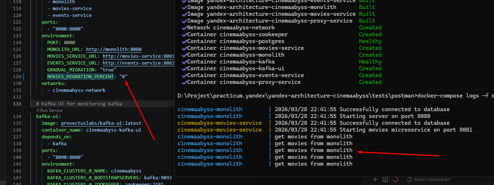
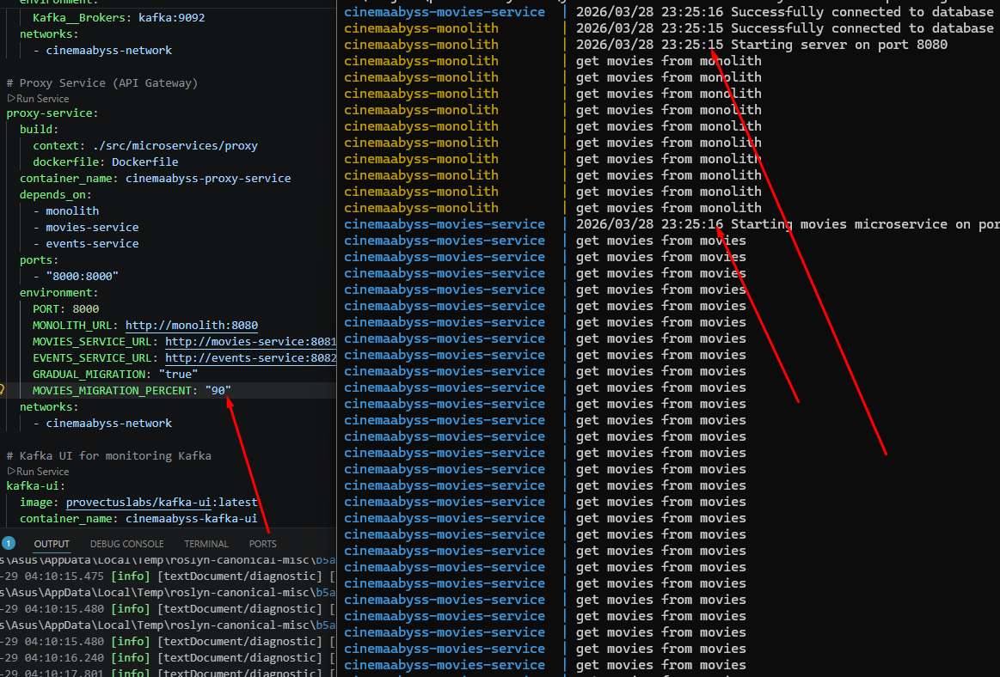
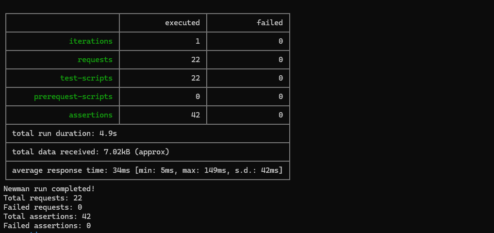
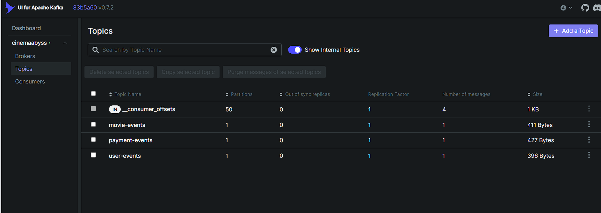

## Изучите [README.md](.\README.md) файл и структуру проекта.

# Задание 1

1. Спроектируйте to be архитектуру КиноБездны, разделив всю систему на отдельные домены и организовав интеграционное взаимодействие и единую точку вызова сервисов.
Результат представьте в виде контейнерной диаграммы в нотации С4.
Добавьте ссылку на файл в этот шаблон

#### Диаграмма контейнеров C4

[docs/Container.puml](docs/Container.puml)

Система разделена на 5 бизнес-доменов, объединённых через единую точку входа — API Gateway:

| Сервис | Технология | Назначение |
|---|---|---|
| API Gateway (Proxy Service) | C# / Ocelot | Единая точка входа, маршрутизация, балансировка |
| Users Service | Go | Аутентификация, управление пользователями, избранное |
| Movies Service | Go | Метаданные фильмов: жанры, актёры, оценки |
| Content Service | Go | Управление видеоконтентом, права доступа, Signed URL |
| Payments Service | Go | Платежи, история транзакций |
| Subscriptions Service | Go | Подписки, тарифные планы, скидки |

Интеграционное взаимодействие между доменами реализовано через Apache Kafka (асинхронные события). Видеодоставка вынесена в AWS: транскодирование через AWS Elemental MediaConvert, CDN-доставка HLS/DASH-сегментов через Amazon CloudFront из Amazon S3.

#### Диаграммы последовательностей

**[docs/MediaProcessingFlow.puml](docs/MediaProcessingFlow.puml)** — поток загрузки и подготовки видео:
Администратор загружает MP4 через API Gateway → Content Service сохраняет файл в S3 и запускает Job в AWS MediaConvert → MediaConvert транскодирует видео в HLS/DASH и сохраняет сегменты обратно в S3 → Content Service получает Webhook о готовности и публикует событие `VideoProcessedAndReady` в Kafka → Movies Service подписывается на событие и обновляет доступность фильма.

**[docs/PlaybackFlow.puml](docs/PlaybackFlow.puml)** — поток воспроизведения контента пользователем:
Клиент запрашивает доступ к видео через API Gateway → Gateway проверяет подписку через Subscriptions Service → Content Service формирует Signed URL для HLS/DASH манифеста → клиент получает видеопоток напрямую из Amazon CloudFront (минуя API Gateway) → в процессе просмотра клиент периодически отправляет прогресс через API Gateway → Content Service публикует событие `PlaybackProgress` в Kafka.

### План перехода к целевой системе:
1. **Подготовительный этап (Infrastructure & DevOps):**
   - Развертывание кластера Kubernetes (Managed K8s, например Yandex MKS или AWS EKS).
   - Настройка базовых инфраструктурных компонентов: СУБД (PostgreSQL), Apache Kafka, Object Storage (S3 / MinIO).
   - Настройка CI/CD-пайплайнов для непрерывной сборки Docker-образов и деплоя (Helm) в кластер K8s.
2. **Фаза выделения микросервисов (Паттерн Strangler Fig):**
   - Разработка API Gateway (Proxy Service на базе Ocelot) для маршрутизации трафика и балансировки между старым монолитом и новыми сервисами.
   - Выделение домена `Movies` (метаданные о фильмах) в отдельный микросервис. 
   - Выделение домена логирования событий в MVP микросервис `Events-Service` для асинхронного взаимодействия через топики Apache Kafka.
3. **Миграция и частичное переключение (Canary Release):**
   - Деплой выделенных микросервисов и API Gateway в кластер K8s параллельно с работой старого монолита.
   - Активация постепенного переключения трафика для маршрута `/api/movies` (например, 50% на монолит / 50% на выделенный микросервис).
   - Мониторинг стабильности системы, логирования и метрик. Нагрузочное тестирование.
4. **Завершение перехода и перспективы:**
   - Перевод 100% трафика вынесенных эндпоинтов на микросервисы.
   - Поэтапное выделение оставшихся доменов: `users`, `content`, `payments`, `subscriptions`. Вывод из эксплуатации монолита.
   - Интеграция с управляемыми медиа-сервисами (AWS Elemental MediaConvert, MediaPackage, CloudFront) для транскодирования и подготовки видео в форматы HLS/DASH (вместо самописного Nginx VOD).

# Задание 2

### 1. Proxy
Команда КиноБездны уже выделила сервис метаданных о фильмах movies и вам необходимо реализовать бесшовный переход с применением паттерна Strangler Fig в части реализации прокси-сервиса (API Gateway), с помощью которого можно будет постепенно переключать траффик, используя фиче-флаг.


Реализуйте сервис на любом языке программирования в ./src/microservices/proxy.
Конфигурация для запуска сервиса через docker-compose уже добавлена
```yaml
  proxy-service:
    build:
      context: ./src/microservices/proxy
      dockerfile: Dockerfile
    container_name: cinemaabyss-proxy-service
    depends_on:
      - monolith
      - movies-service
      - events-service
    ports:
      - "8000:8000"
    environment:
      PORT: 8000
      MONOLITH_URL: http://monolith:8080
      #монолит
      MOVIES_SERVICE_URL: http://movies-service:8081 #сервис movies
      EVENTS_SERVICE_URL: http://events-service:8082 
      GRADUAL_MIGRATION: "true" # вкл/выкл простого фиче-флага
      MOVIES_MIGRATION_PERCENT: "50" # процент миграции
    networks:
      - cinemaabyss-network
```

- После реализации запустите postman тесты - они все должны быть зеленые (кроме events).
- Отправьте запросы к API Gateway:
   ```bash
   curl http://localhost:8000/api/movies
   ```
- Протестируйте постепенный переход, изменив переменную окружения MOVIES_MIGRATION_PERCENT в файле docker-compose.yml.

#### Реализация proxy-сервиса

Реализован в `src/microservices/proxy` на **C# / ASP.NET Core 8** с использованием **Ocelot** в качестве API Gateway.

**Ключевые компоненты:**
- `PercentageBalancer.cs` — кастомный балансировщик нагрузки, распределяет трафик `/api/movies` между монолитом и movies-service по переменной `MOVIES_MIGRATION_PERCENT`
- `ocelot.json` — таблица маршрутизации:
  - `/api/movies` → 50% monolith + 50% movies-service (управляется `MOVIES_MIGRATION_PERCENT`)
  - `/api/users`, `/api/payments`, `/api/subscriptions` → monolith
  - `/api/events/{everything}` → events-service
  - `/api/movies/health` → movies-service

**Паттерн Strangler Fig:**
`MOVIES_MIGRATION_PERCENT=0` — весь трафик /api/movies идёт в монолит.
`MOVIES_MIGRATION_PERCENT=50` — 50/50 между монолитом и movies-service.
`MOVIES_MIGRATION_PERCENT=100` — весь трафик /api/movies уходит в movies-service.

**Важно: алгоритм балансировки — последовательный, не случайный.**
`PercentageBalancer` использует атомарный счётчик (`_counter`), а не `Random`. При `MOVIES_MIGRATION_PERCENT=60` внутри каждого цикла из 100 запросов:
- запросы 0–39 (counter % 100 < 40) → **монолит** (40% веса)
- запросы 40–99 (counter % 100 ≥ 40) → **movies-service** (60% веса)

Это означает, что первые 40 запросов после старта контейнера уйдут в монолит, и только начиная с 41-го появятся запросы к movies-service. Для наблюдаемого распределения нужно отправить достаточное количество запросов:

```bash
# Отправить 10 запросов и увидеть ответы (первые 50 символов каждого)
bash -c 'for i in {1..10}; do curl -s http://localhost:8000/api/movies | head -c 50; echo; done'

# Проверить распределение по логам
docker-compose logs --tail=200 monolith movies-service | grep "get movies"
# Ожидаемо при MOVIES_MIGRATION_PERCENT=60: ~40% строк от monolith, ~60% от movies-service
```

Для быстрой проверки работы переключения используйте крайние значения (0 и 100):
```bash
# Изменить в docker-compose.yml и перезапустить только proxy
docker-compose up -d --no-build proxy-service
```

**Скриншот при MOVIES_MIGRATION_PERCENT=0 (все запросы → монолит):**



**Скриншот при MOVIES_MIGRATION_PERCENT=90 (90% запросов → movies-service):**




### 2. Kafka
 Вам как архитектуру нужно также проверить гипотезу насколько просто реализовать применение Kafka в данной архитектуре.

Для этого нужно сделать MVP сервис events, который будет при вызове API создавать и сам же читать сообщения в топике Kafka.

    - Разработайте сервис на любом языке программирования с consumer'ами и producer'ами.
    - Реализуйте простой API, при вызове которого будут создаваться события User/Payment/Movie и обрабатываться внутри сервиса с записью в лог
    - Добавьте в docker-compose новый сервис, kafka там уже есть

Необходимые тесты для проверки этого API вызываются при запуске npm run test:local из папки tests/postman
Приложите скриншот тестов и скриншот состояния топиков Kafka из UI http://localhost:8090

#### Реализация events-сервиса

Реализован в `src/microservices/events` на **C# / ASP.NET Core 8** с использованием **MassTransit + Kafka**.

**API эндпоинты:**
- `POST /api/events/movie` — создаёт событие в топике `movie-events`
- `POST /api/events/user` — создаёт событие в топике `user-events`
- `POST /api/events/payment` — создаёт событие в топике `payment-events`
- `GET /api/events/health` — health check

**Kafka топики:** `movie-events`, `user-events`, `payment-events`

**Архитектура:**
Каждый POST-запрос через MassTransit публикует сообщение в Kafka (producer).
Consumers той же consumer-группы (`events-service-group`) читают сообщения и записывают в лог с информацией о partition и offset.
Сервис одновременно является producer и consumer — MVP для проверки гипотезы.

#### Результаты тестирования

Запуск стека:
```bash
docker-compose up --build
```

Запуск postman-тестов:
```bash
cd tests/postman && npm run test:local
```

**Скриншот postman-тестов (все зелёные):**



**Скриншот состояния топиков Kafka (http://localhost:8090):**



# Задание 3

Команда начала переезд в Kubernetes для лучшего масштабирования и повышения надежности. 
Вам, как архитектору осталось самое сложное:
 - реализовать CI/CD для сборки прокси сервиса
 - реализовать необходимые конфигурационные файлы для переключения трафика.


### CI/CD

 В папке .github/worflows доработайте деплой новых сервисов proxy и events в docker-build-push.yml , чтобы api-tests при сборке отрабатывали корректно при отправке коммита в ваш репозиторий.

Нужно доработать 
```yaml
on:
  push:
    branches: [ main ]
    paths:
      - 'src/**'
      - '.github/workflows/docker-build-push.yml'
  release:
    types: [published]
```
и добавить необходимые шаги в блок
```yaml
jobs:
  build-and-push:
    runs-on: ubuntu-latest
    permissions:
      contents: read
      packages: write

    steps:
      - name: Checkout repository
        uses: actions/checkout@v3

      - name: Set up Docker Buildx
        uses: docker/setup-buildx-action@v2

      - name: Log in to the Container registry
        uses: docker/login-action@v2
        with:
          registry: ${{ env.REGISTRY }}
          username: ${{ github.actor }}
          password: ${{ secrets.GITHUB_TOKEN }}

```
Как только сборка отработает и в github registry появятся ваши образы, можно переходить к блоку настройки Kubernetes
Успешным результатом данного шага является "зеленая" сборка и "зеленые" тесты


### Proxy в Kubernetes

#### Шаг 1
Для деплоя в kubernetes необходимо залогиниться в docker registry Github'а.
1. Создайте Personal Access Token (PAT) https://github.com/settings/tokens . Создавайте class с правом read:packages
2. В src/kubernetes/*.yaml (event-service, monolith, movies-service и proxy-service)  отредактируйте путь до ваших образов 
```bash
 spec:
      containers:
      - name: events-service
        image: ghcr.io/ваш логин/имя репозитория/events-service:latest
```
3. Добавьте в секрет src/kubernetes/dockerconfigsecret.yaml в поле
```bash
 .dockerconfigjson: значение в base64 файла ~/.docker/config.json
```

4. Если в ~/.docker/config.json нет значения для аутентификации
```json
{
        "auths": {
                "ghcr.io": {
                       тут пусто
                }
        }
}
```
то выполните 

и добавьте

```json 
 "auth": "имя пользователя:токен в base64"
```

Чтобы получить значение в base64 можно выполнить команду
```bash
 echo -n ваш_логин:ваш_токен | base64
```

После заполнения config.json, также прогоните содержимое через base64

```bash
cat .docker/config.json | base64
```

и полученное значение добавляем в

```bash
 .dockerconfigjson: значение в base64 файла ~/.docker/config.json
```

#### Шаг 2

  Доработайте src/kubernetes/event-service.yaml и src/kubernetes/proxy-service.yaml

  - Необходимо создать Deployment и Service 
  - Доработайте ingress.yaml, чтобы можно было с помощью тестов проверить создание событий
  - Выполните дальшейшие шаги для поднятия кластера:

  1. Создайте namespace:
  ```bash
  kubectl apply -f src/kubernetes/namespace.yaml
  ```
  2. Создайте секреты и переменные
  ```bash
  kubectl apply -f src/kubernetes/configmap.yaml
  kubectl apply -f src/kubernetes/secret.yaml
  kubectl apply -f src/kubernetes/dockerconfigsecret.yaml
  kubectl apply -f src/kubernetes/postgres-init-configmap.yaml
  ```

  3. Разверните базу данных:
  ```bash
  kubectl apply -f src/kubernetes/postgres.yaml
  ```

  На этом этапе если вызвать команду
  ```bash
  kubectl -n cinemaabyss get pod
  ```
  Вы увидите

  NAME         READY   STATUS    
  postgres-0   1/1     Running   

  4. Разверните Kafka:
  ```bash
  kubectl apply -f src/kubernetes/kafka/kafka.yaml
  ```

  Проверьте, теперь должно быть запущено 3 пода, если что-то не так, то посмотрите логи
  ```bash
  kubectl -n cinemaabyss logs имя_пода (например - kafka-0)
  ```

  5. Разверните монолит:
  ```bash
  kubectl apply -f src/kubernetes/monolith.yaml
  ```
  6. Разверните микросервисы:
  ```bash
  kubectl apply -f src/kubernetes/movies-service.yaml
  kubectl apply -f src/kubernetes/events-service.yaml
  ```
  7. Разверните прокси-сервис:
  ```bash
  kubectl apply -f src/kubernetes/proxy-service.yaml
  ```

  После запуска и поднятия подов вывод команды 
  ```bash
  kubectl -n cinemaabyss get pod
  ```

  Будет наподобие такого

```bash
  NAME                              READY   STATUS    

  events-service-7587c6dfd5-6whzx   1/1     Running  

  kafka-0                           1/1     Running   

  monolith-8476598495-wmtmw         1/1     Running  

  movies-service-6d5697c584-4qfqs   1/1     Running  

  postgres-0                        1/1     Running  

  proxy-service-577d6c549b-6qfcv    1/1     Running  

  zookeeper-0                       1/1     Running 
```

  8. Добавим ingress

  - добавьте аддон
  ```bash
  minikube addons enable ingress
  ```
  ```bash
  kubectl apply -f src/kubernetes/ingress.yaml
  ```
  9. Добавьте в /etc/hosts
  127.0.0.1 cinemaabyss.example.com

  10. Вызовите
  ```bash
  minikube tunnel
  ```
  11. Вызовите https://cinemaabyss.example.com/api/movies
  Вы должны увидеть вывод списка фильмов
  Можно поэкспериментировать со значением   MOVIES_MIGRATION_PERCENT в src/kubernetes/configmap.yaml и убедится, что вызовы movies уходят полностью в новый сервис

  12. Запустите тесты из папки tests/postman
  ```bash
   npm run test:kubernetes
  ```
  Часть тестов с health-чек упадет, но создание событий отработает.
  Откройте логи event-service и сделайте скриншот обработки событий

#### Шаг 3
Добавьте сюда скриншота вывода при вызове https://cinemaabyss.example.com/api/movies и  скриншот вывода event-service после вызова тестов.


# Задание 4
Для простоты дальнейшего обновления и развертывания вам как архитектуру необходимо так же реализовать helm-чарты для прокси-сервиса и проверить работу 

Для этого:
1. Перейдите в директорию helm и отредактируйте файл values.yaml

```yaml
# Proxy service configuration
proxyService:
  enabled: true
  image:
    repository: ghcr.io/db-exp/cinemaabysstest/proxy-service
    tag: latest
    pullPolicy: Always
  replicas: 1
  resources:
    limits:
      cpu: 300m
      memory: 256Mi
    requests:
      cpu: 100m
      memory: 128Mi
  service:
    port: 80
    targetPort: 8000
    type: ClusterIP
```

- Вместо ghcr.io/db-exp/cinemaabysstest/proxy-service напишите свой путь до образа для всех сервисов
- для imagePullSecret проставьте свое значение (скопируйте из конфигурации kubernetes)
  ```yaml
  imagePullSecrets:
      dockerconfigjson: ewoJImF1dGhzIjogewoJCSJnaGNyLmlvIjogewoJCQkiYXV0aCI6ICJaR0l0Wlhod09tZG9jRjl2UTJocVZIa3dhMWhKVDIxWmFVZHJOV2hRUW10aFVXbFZSbTVaTjJRMFNYUjRZMWM9IgoJCX0KCX0sCgkiY3JlZHNTdG9yZSI6ICJkZXNrdG9wIiwKCSJjdXJyZW50Q29udGV4dCI6ICJkZXNrdG9wLWxpbnV4IiwKCSJwbHVnaW5zIjogewoJCSIteC1jbGktaGludHMiOiB7CgkJCSJlbmFibGVkIjogInRydWUiCgkJfQoJfSwKCSJmZWF0dXJlcyI6IHsKCQkiaG9va3MiOiAidHJ1ZSIKCX0KfQ==
  ```

2. В папке ./templates/services заполните шаблоны для proxy-service.yaml и events-service.yaml (опирайтесь на свою kubernetes конфигурацию - смысл helm'а сделать шаблоны для быстрого обновления и установки)

```yaml
template:
    metadata:
      labels:
        app: proxy-service
    spec:
      containers:
       Тут ваша конфигурация
```

3. Проверьте установку
Сначала удалим установку руками

```bash
kubectl delete all --all -n cinemaabyss
kubectl delete  namespace cinemaabyss
```
Запустите 
```bash
helm install cinemaabyss .\src\kubernetes\helm --namespace cinemaabyss --create-namespace
```
Если в процессе будет ошибка
```code
[2025-04-08 21:43:38,780] ERROR Fatal error during KafkaServer startup. Prepare to shutdown (kafka.server.KafkaServer)
kafka.common.InconsistentClusterIdException: The Cluster ID OkOjGPrdRimp8nkFohYkCw doesn't match stored clusterId Some(sbkcoiSiQV2h_mQpwy05zQ) in meta.properties. The broker is trying to join the wrong cluster. Configured zookeeper.connect may be wrong.
```

Проверьте развертывание:
```bash
kubectl get pods -n cinemaabyss
minikube tunnel
```

Потом вызовите 
https://cinemaabyss.example.com/api/movies
и приложите скриншот развертывания helm и вывода https://cinemaabyss.example.com/api/movies

## Удаляем все

```bash
kubectl delete all --all -n cinemaabyss
kubectl delete namespace cinemaabyss
```
